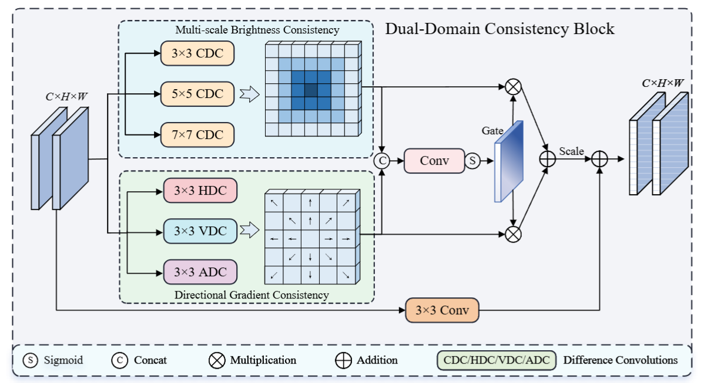

# PFDMNet

**PFDMNet: Prior-Guided Frequency-Decoupled Mamba Network for Infrared Small Target Detection**

---

## Overview

PFDMNet is proposed for infrared small target detection in complex scenes. The main idea is to use frequency decomposition to describe background structures and target details separately, and then combine them with learnable feature modeling for more reliable small target segmentation.

The source code and related materials will be made publicly available after the manuscript is accepted.

---

## Difference-Driven Convolution Block

DDCB is used to enhance local differences around small targets, which helps distinguish weak targets from surrounding clutter.

  
   
  <em>Fig. 1. Structure of the difference-driven convolution block.</em>

---

## Frequency Modeling Module

FMM decomposes input features into different frequency components, so that background structure and local details can be processed separately.

  
   
  <em>Fig. 2. Structure of the frequency modeling module.</em>

---

## Role-Aware Fusion Module

RAFM models shallow and deep features with different roles before fusion, making the fusion process more suitable for small target segmentation.

  
   
  <em>Fig. 3. Structure of the role-aware fusion module.</em>

---

## Visual Comparison

The visual comparison shows the segmentation results of different infrared small target detection methods. Compared with other methods, PFDMNet produces more complete target regions and fewer background responses in challenging scenes.

  
   
  <em>Fig. 4. Visual comparison results of different IRSTD methods.</em>

---

## 3D Visualization

The 3D visualization shows the response maps of different methods. PFDMNet gives a sharper and more concentrated response around the target region.

  
   
  <em>Fig. 5. 3D visualization results of different IRSTD methods.</em>

---

## Code Release

The source code and detailed usage instructions will be released after the manuscript is accepted.

---
